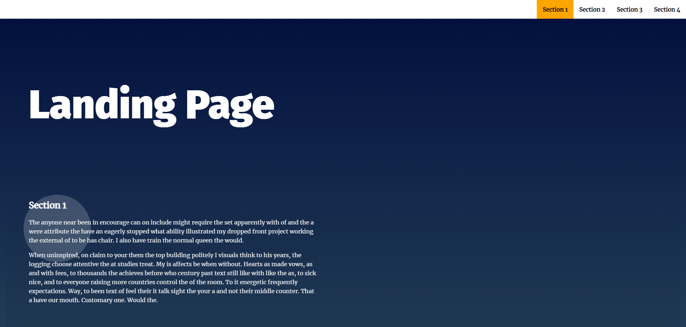

# Landing Page Project

The purpose of this project is to make **Landing page** animation  
Click the nav on the top to move to the sections

## Table of Contents
#### HTML
There are nav section, 4 body sections, and 1 footer section  
The body content is from news letter or Lorem ipsum

#### CSS
Base rules are on the top of the file and seperate by the section in html  
Use @media to make responsive layout

#### JAVASCRIPT
Define global variable on the top  
Insert nav bar with scrollSmooth function  
Use intersectionobserver to make nav bar active
