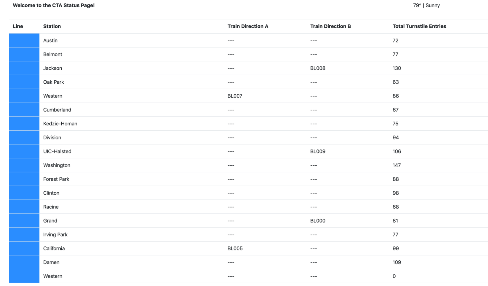
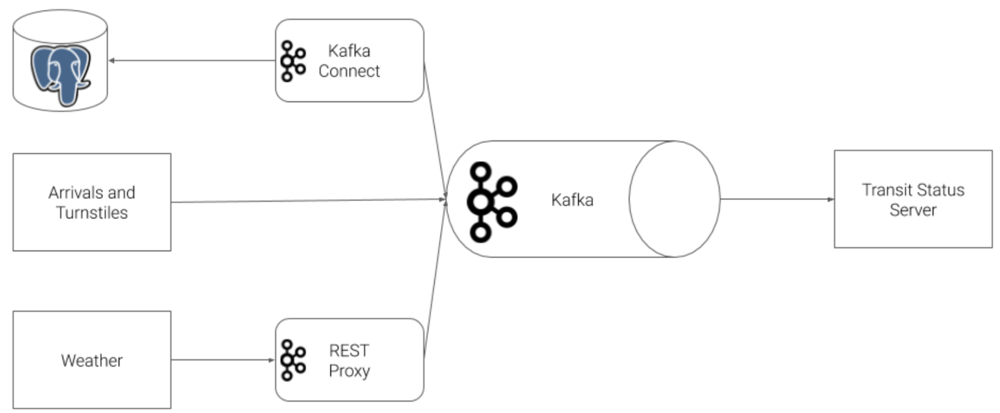

## Optimizing Public Transportation

#### [설명]

#### [기술스택]
Kafka, Flink, Faust, Python

#### [데이터 예시]

#### [구성도]

#### [배운점]
- 스트림 처리 개요
    - 스트림 데이터 저장소 및 스트림 처리 이해
    - 실세계 스트림 처리 사용 사례 설명
    - Kafka CLI 도구 및 Confluent Kafka Python 라이브러리를 사용한 토픽 관리, 생산 및 소비
- Apache Kafka
    - Kafka 아키텍처, 토픽 및 구성 이해
    - Confluent Kafka Python을 사용하여 프로듀서 및 컨슈머 생성 및 구성
    - 사용자 프라이버시 고려 사항 및 소비자, 프로듀서, 클러스터 성능 모니터링
- 데이터 스키마 및 Apache Avro
    - 데이터 스키마의 개념과 가치 이해
    - AvroProducer 및 AvroConsumer 사용법
    - 스키마 진화 및 데이터 호환성 관리
- Kafka Connect 및 REST Proxy
    - Kafka Connect의 문제 해결 및 일반 커넥터 설명
    - REST Proxy 메타데이터 및 관리 API 사용법
    - REST Proxy 프로듀서 및 컨슈머 API 사용법
- 스트림 처리 기본
    - 스트림 처리 시나리오 및 전략 이해
    - 스트림 처리에서의 시간 및 윈도우 처리 방법 설명
    - 스트림과 테이블의 차이점 및 사용 사례 이해
- Faust를 사용한 스트림 처리
    - Faust 스트림 처리 Python 라이브러리의 역할 및 사용법
    - 스트림 기반 및 테이블 기반 애플리케이션 생성
    - Faust 프로세서 및 함수 사용법
- KSQL
    - KSQL의 역할 및 아키텍처 이해
    - KSQL 스트림 및 테이블 생성
    - KSQL 쿼리 및 윈도우 처리 사용법

## Evaluate Human Balance with Spark Streaming

#### [설명]
STEDI는 노인의 균형을 평가하는 소규모 스타트업입니다. 이 프로젝트에서는 노인의 운동 데이터를 수집하여 균형 위험을 평가하는 STEDI 애플리케이션을 개선합니다.  사용자가 운동을 시작하고 각 걸음마다 버튼을 클릭하면 데이터가 전송되어 노인의 균형 위험을 모니터링합니다.  

#### [기술스택]
Kafka, Spark Streaming, Redis

#### [데이터 예시]
{"customer":"Jason.Mitra@test.com","score":7.0,"riskDate":"2020-09-14T07:54:06.417Z"}

#### [배운점]
- Apache Kafka
    - Kafka의 아키텍처, 토픽 관리, 프로듀서 및 컨슈머 설정을 이해하고 이를 활용하여 실시간 데이터 스트리밍 시스템을 구축했습니다.
- Spark Streaming
    - Spark Streaming을 사용하여 실시간 데이터를 처리하고 분석하는 방법을 배웠습니다. 
- Redis: 
    - Redis를 Kafka와 통합하여 실시간 데이터를 전송하고 처리하는 방법을 학습했습니다.